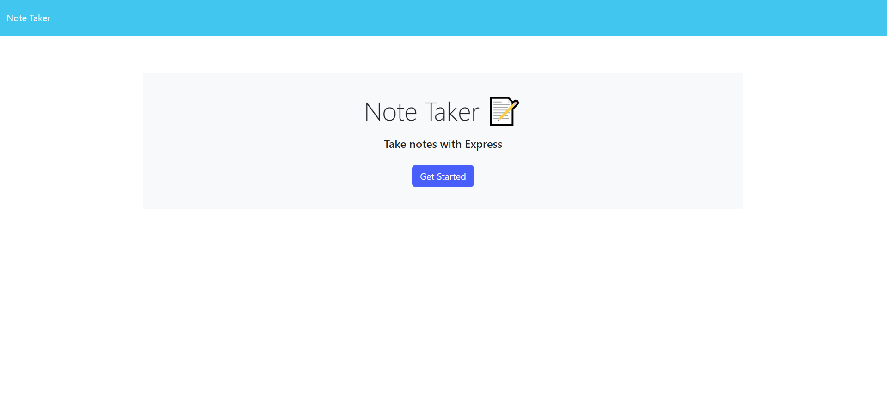

# Note Taker

## Description

This Project is deployed on heroku. The purpose of this application is to create a Note Taker web applicaiton where you can add notes and access from any computer. The information is stored on the Heroku servers rather than the local storage allowing it to be access on any computer. In addition to adding notes, you can delete notes as well, giving you a more precise list of notes and reminders.

## Repository
https://github.com/evan17812/Note-Taker

## Screenshot
